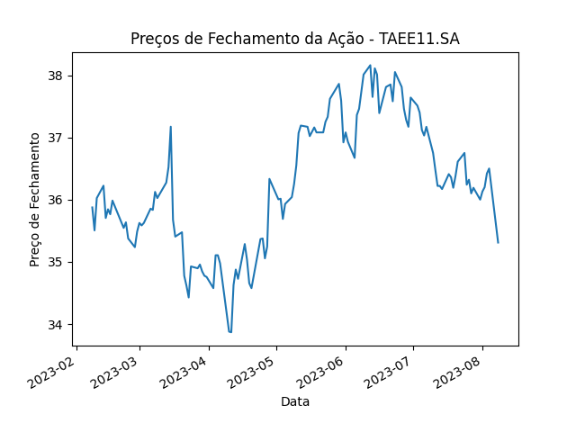

### Obtendo Dados da Bolsa e Plotando Gráfico de Fechamento

Neste tutorial, você aprenderá como usar a biblioteca `yfinance` para buscar informações da bolsa de valores e como plotar um gráfico de fechamento usando a biblioteca `matplotlib`.

### Instalação das Bibliotecas

Antes de começar, certifique-se de que você tenha as bibliotecas `yfinance` e `matplotlib` instaladas. Se ainda não tiver, você pode instalá-las usando os seguintes comandos:

```bash
pip install yfinance
pip install matplotlib
```

### Passo 1: Buscando Dados da Bolsa

Primeiro, você precisará importar as bibliotecas necessárias e usar a função `Ticker` do `yfinance` para buscar os dados da bolsa. Aqui está um exemplo de como fazer isso:

```python
import yfinance as yf

# Buscar os dados da bolsa
dados = yf.Ticker("TAEE11.SA").history("6mo")
fechamento = dados['Close']  # Coluna de fechamento da bolsa
```

### Passo 2: Plotando o Gráfico de Fechamento

Agora que você tem os dados de fechamento, pode usar a biblioteca `matplotlib` para criar um gráfico. Aqui está um exemplo de como plotar o gráfico de fechamento:

```python
import matplotlib.pyplot as plt

# Plotar o gráfico de fechamento
fechamento.plot()
plt.title("Preços de Fechamento TAEE11.SA")
plt.xlabel("Data")
plt.ylabel("Preço de Fechamento")
plt.show()
```

Abaixo segue a plotagem:



Certifique-se de executar o código em um ambiente de desenvolvimento Python, como o Jupyter Notebook, o Visual Studio Code ou qualquer outro ambiente compatível com a exibição de gráficos.

Agora você tem um guia básico sobre como buscar informações da bolsa de valores usando a biblioteca `yfinance` e plotar um gráfico de fechamento usando a biblioteca `matplotlib`.


###### FIM
