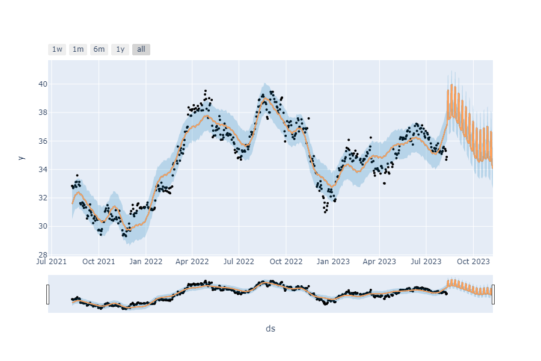

## Análise de Ações com Prophet e Plotly

Neste exemplo, mostraremos como realizar uma análise de ações usando as bibliotecas `yfinance`, `Prophet` e `Plotly` em Python.

```python
import yfinance as yf
from prophet import Prophet
from prophet.plot import plot_plotly
import plotly.graph_objects as go

# Solicita ao usuário que insira o código da ação para análise
ticker = input("Digite o código da ação para análise: ")

# Busca os dados históricos da ação usando a biblioteca yfinance
dados = yf.Ticker(ticker).history("2y")

# Tratando os dados
treinamento = dados.reset_index()
treinamento = treinamento[["Date", "Close"]]
treinamento["Date"] = treinamento["Date"].dt.date
treinamento.columns = ["ds", "y"]
print(treinamento)

# Criando e treinando o modelo de Machine Learning usando a biblioteca Prophet
modelo = Prophet()
modelo.fit(treinamento)

# Criando o período de previsão
periodo = modelo.make_future_dataframe(90)

# Criando as previsões usando o modelo treinado
previsoes = modelo.predict(periodo)

# Plotando as previsões
plotagem = plot_plotly(modelo, previsoes)
fig = go.Figure(data=plotagem)
fig.add_trace(go.Scatter(x=previsoes.ds, y=previsoes.yhat))

# Escreve o gráfico interativo em um arquivo HTML
fig.write_html("previsao.html")

# Escreve o gráfico como uma imagem PNG
fig.write_image("previsao.png")

```

Abaixo o Gráfico em .png



Abaixo clique no link para ver o Gráfico interativo

[previsao.html](previsao.html)